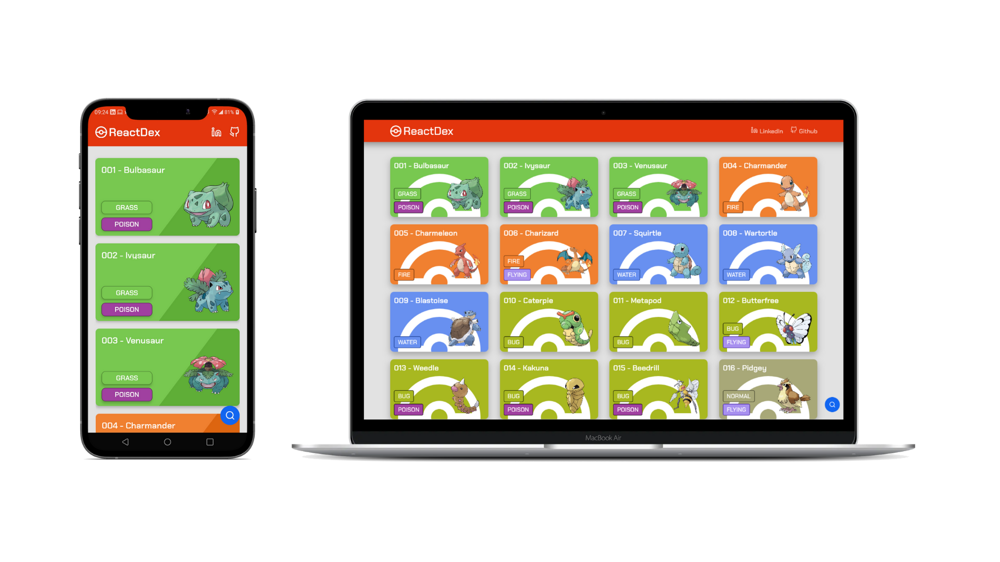

<h1 align="center">
  ReactDex
</h1>

  
  
  

## 📝️ Sobre

O projeto **ReactDex** foi um projeto com objetivo de demonstrar os conhecimentos utilizando a stack react desenvolvendo sozinho uma Aplicação Web e Mobile consumindo a [API do Pokémon](https://pokeapi.co/). Para o desenvolvimento foi utilizado principalmente as bibliotecas React.JS para desenvolver o front-end web e React.Native para desenvolver o aplicativo mobile.

O sistema web e o aplicativo tem as mesmas funcionalidades, com eles é possível listar todos os pokémons existentes, além de poder pesquisar por um em especifico. Também é possivel visualizar detalhes avançados do pokémon na página de detalhes do mesmo.

### Links do sistema e do app:
- [ReactDex Web](https://github.com/IgorCazeNunes/ReactDex/tree/main/frontend)
- [ReactDex Mobile](https://github.com/IgorCazeNunes/ReactDex/tree/main/mobile)

## 🤔️ Como contribuir

1. Faça o `fork` deste repositório
2. Crie uma branch com sua feature:
   - `$ git checkout -b minha_feature`
3. Confirme sua branch:
   - `$ git commit -m "feature: Meu novo recurso"`
4. Envie sua branch:
   - `$ git push origin minha_feature`

---

<h4 align="center">
  Feito com 💜 por Igor 👋️ <a href="https://www.linkedin.com/in/IgorCazeNunes/" target="_blank">Entre em contato!</a>
</h4>

---
